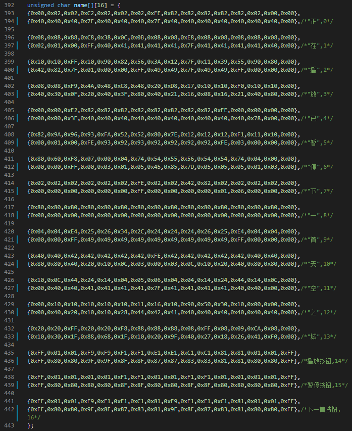
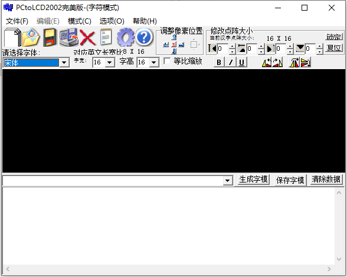

### oled显示模块

#### 字符显示

根据oled屏幕官方文档，发现该oled的显存通过二维数组来储存，储存格式如下
```c
//OLED的显存
//存放格式如下.
//[0]0 1 2 3 ... 127    
//[1]0 1 2 3 ... 127    
//[2]0 1 2 3 ... 127    
//[3]0 1 2 3 ... 127    
//[4]0 1 2 3 ... 127    
//[5]0 1 2 3 ... 127    
//[6]0 1 2 3 ... 127    
//[7]0 1 2 3 ... 127

u8 OLED_GRAM[128][8];	 
```
并通过`WriteCmd(u8 data)`和`WriteDat(u8 data)`两个函数来对屏幕显示内容进行像素点级别的修改，这两个函数的代码如下
```c
void WriteCmd(u8 command)
{
    IIC_Start();
    IIC_Send_Byte(0x78);//OLED地址
    IIC_Wait_Ack();
    IIC_Send_Byte(0x00);//寄存器地址
    IIC_Wait_Ack();
    IIC_Send_Byte(command);
    IIC_Wait_Ack();
    IIC_Stop();
}

void WriteDat(u8 data)
{
    IIC_Start();
    IIC_Send_Byte(0x78);//OLED地址
    IIC_Wait_Ack();
    IIC_Send_Byte(0x40);//寄存器地址
    IIC_Wait_Ack();
    IIC_Send_Byte(data);
    IIC_Wait_Ack();
    IIC_Stop();
}
```

直接通过这两个函数修改屏幕太过麻烦，因此决定使用`修改显存`->`刷新屏幕`的方法来更加节省方便的修改屏幕内容使用了`OLED_Refresh_Gram()`函数来进行屏幕的刷新，`OLED_DrawPoint(u8 x, u8 y, u8 t)`来决定屏幕上单个点的显示/熄灭。具体代码如下
```c
//更新显存到LCD		 
void OLED_Refresh_Gram(void)
{
	u8 i,n;		    
	for(i=0;i<8;i++)  
	{  
		WriteCmd (0xb0+i);    //设置页地址（0~7）
		WriteCmd (0x00);      //设置显示位置—列低地址
		WriteCmd (0x10);      //设置显示位置—列高地址   
		for(n=0;n<128;n++)
			WriteDat(OLED_GRAM[n][i]); 
	}   
}

//画点 
//x:0~127
//y:0~63
//t:1 填充 0,清空				   
void OLED_DrawPoint(u8 x,u8 y,u8 t)
{
	u8 pos,bx,temp=0;
	if(x>127||y>63)return;//超出范围了.
	pos=7-y/8;
	bx=y%8;
	temp=1<<(7-bx);
	if(t)OLED_GRAM[127-x][pos]|=temp;
	else OLED_GRAM[127-x][pos]&=~temp;	    
}
```

完成了点的显示后，便可以通过点的一定位置的显示，从而实现在屏幕上字符的显示。但是，为了方便函数的编写和参数的传递，决定使用字库来简便操作，在`/HARDWARE/OLED/oledfont.h`文件中，存放了若干二维数组，分别代表6/8/12/24号的ascii字符以及中文字符，中文字符如下图



> 中文字符的数组是通过OLED官方给的`PCtoLCD2002`软件生成的
>
> 

在此基础上，完成了显示字符/字符串/数字/汉字的三个函数，代码如下

```c
//在指定位置显示一个字符,包括部分字符
//x:0~127
//y:0~63
//mode:0,反白显示;1,正常显示				 
//size:选择字体 12/16/24
void OLED_ShowChar(u8 x,u8 y,u8 chr,u8 size,u8 mode)
{      			    
	u8 temp,t,t1;
	u8 y0=y;
	u8 csize=(size/8+((size%8)?1:0))*(size/2);		//得到字体一个字符对应点阵集所占的字节数
	chr=chr-' ';//得到偏移后的值		 
    for(t=0;t<csize;t++)
    {   
			if(size==12)temp=asc2_1206[chr][t]; 	 	//调用1206字体
			else if(size==16)temp=asc2_1608[chr][t];	//调用1608字体
			else if(size==24)temp=asc2_2412[chr][t];	//调用2412字体
			else return;								//没有的字库
			for(t1=0;t1<8;t1++)
			{
				if(temp&0x80)OLED_DrawPoint(x,y,mode);
				else OLED_DrawPoint(x,y,!mode);
				temp<<=1;
				y++;
				if((y-y0)==size)
				{
					y=y0;
					x++;
					break;
				}
			}  	 
    }          
}
		  

//显示字符串
//x,y:起点坐标  
//size:字体大小 
//*p:字符串起始地址 
void OLED_ShowString(u8 x,u8 y,const u8 *p,u8 size)
{	
    while((*p<='~')&&(*p>=' '))//判断是不是非法字符!
    {       
        if(x>(128-(size/2))){x=0;y+=size;}
        if(y>(64-size)){y=x=0;OLED_Clear();}
        OLED_ShowChar(x,y,*p,size,1);	 
        x+=size/2;
        p++;
    }  
	
}	

//显示一个数字
//x,y :????	 
//len :?????
//size:????
//mode:??	0,????;1,????
//num:??(0~4294967295);	 	  
void OLED_ShowNum(u8 x,u8 y,u32 num,u8 len,u8 size)
{         	
	u8 t,temp;
	u8 enshow=0;						   
	for(t=0;t<len;t++)
	{
		temp=(num/mypow(10,len-t-1))%10;
		if(enshow==0&&t<(len-1))
		{
			if(temp==0)
			{
				OLED_ShowChar(x+(size/2)*t,y,' ',size,1);
				continue;
			}else enshow=1; 
		 	 
		}
	 	OLED_ShowChar(x+(size/2)*t,y,temp+'0',size,1); 
	}
}

//显示汉字
void OLED_ShowChinese(u8 x,u8 y,u8 num,u8 size1)
{
	u8 i,m,n=0,temp,chr1;
	u8 x0=x,y0=y;
	u8 size3=size1/8;
	while(size3--)
	{
		chr1=num*size1/8+n;
		n++;
			for(i=0;i<size1;i++)
			{
				if(size1==16)
						{temp=name[chr1][i];}//调用16*16字体
							
						for(m=0;m<8;m++)
							{
								if(temp&0x01)OLED_DrawPoint(x,y,1);
								else OLED_DrawPoint(x,y,0);
								temp>>=1;
								y++;
							}
							x++;
							if((x-x0)==size1)
							{x=x0;y0=y0+8;}
							y=y0;
			 }
	}
}
```

通过使用这三个函数，便可以在屏幕上的`指定位置`显示`固定大小`的字符/数字/汉字

#### 显示控制

### 感想

米家龙：

显示模块中的函数本身并不难实现，官方也给了相关的教程和相关样例代码，实际修改起来并不困难，但是调试的过程比较麻烦，因为错误往往是像素点级别的，往往修改了一个参数，结果导致了整个屏幕的显示乱码，坏的一塌糊涂。这些错误帮助我加深了对单片机相关架构的理解，并且了解了数组作为显存的方法，掌握了OLED的使用和相关函数的编写。

单片机本身看似复杂，但是很多配置官方已经给出样例，因此只需要理解并修改就好，并不是完全的两眼一抹黑，在理解了相关的参数后，就能发现单片机的有趣之处